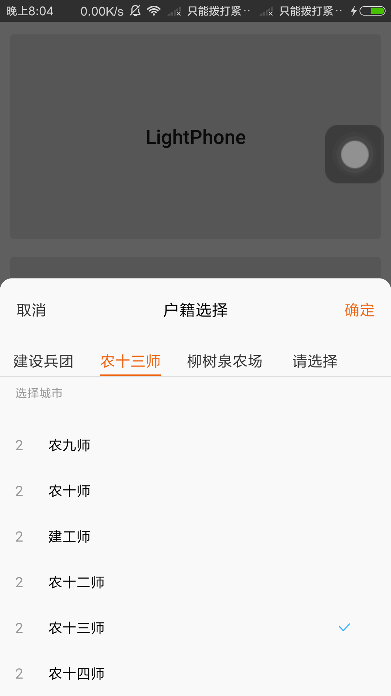
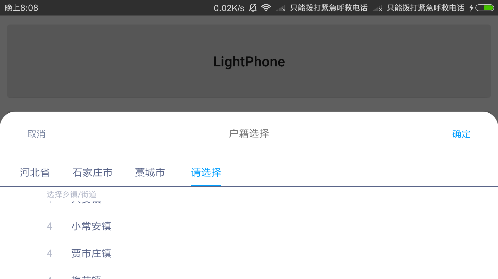
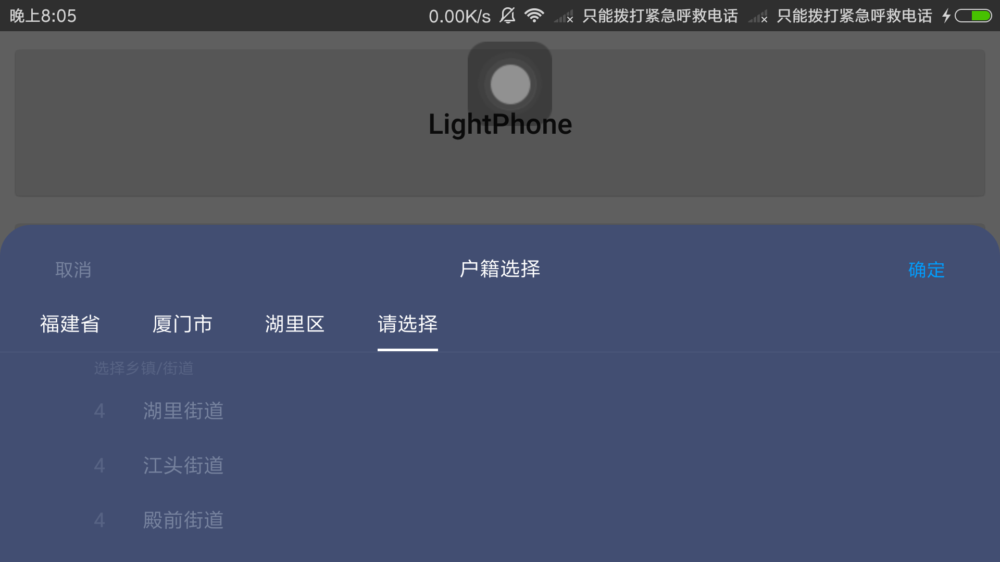
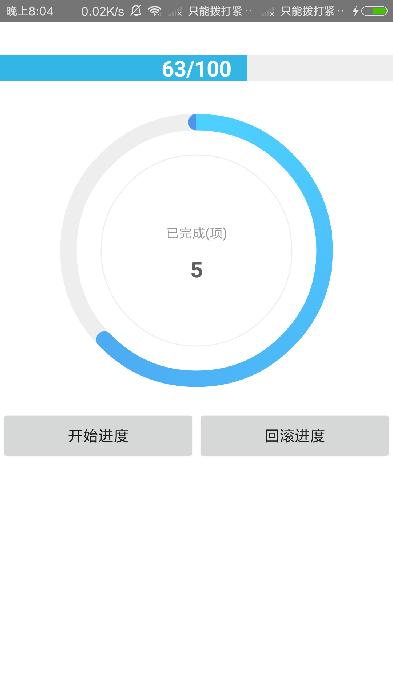
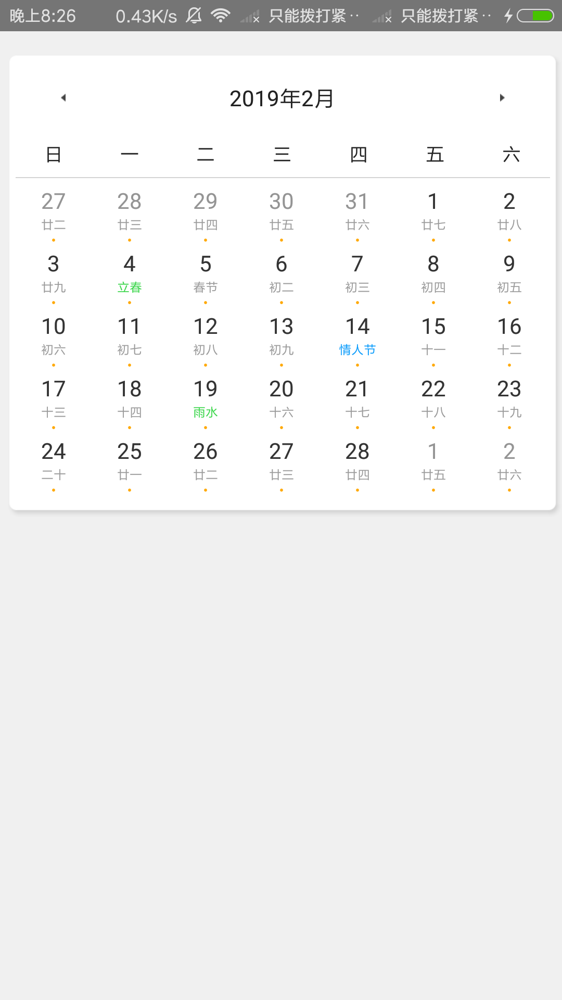

- [HenCoder](app/src/main/java/com/work/basic)
> View Basic Improve : Canvas / Paint / Animation / Sample

- [FloatWindow-仿苹果全局悬浮窗](app/src/main/java/com/work/floatwindow)
- [RecyclerView-横向滑动至中心点](app/src/main/java/com/work/recycler)
- [带阴影效果的分割线](app/src/main/java/com/work/shadowline)
- [Spinner单选&多选,多选支持实时更新](app/src/main/java/com/work/spinner)

- [地址选择器(适配Phone和Pad端)](app/src/main/java/com/work/addresspicker)
> 地址选择器-Phone

> 地址选择器-Pad白色主题

> 地址选择器-Pad黑色主题

- [进度条和进度圆环](app/src/main/java/com/work/progressbar)

- [Banner轮播图](app/src/main/java/com/work/banner)

- [日历-Recycler](app/src/main/java/com/work/calendarnew)

- TODO 2019年2月10日 20:48:52 优化代码,整合新控件